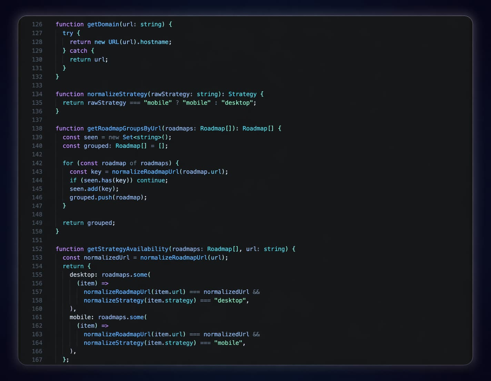

# Omakase

A curated VS Code theme collection with deep dark surfaces and calm aqua-blue contrast.

## Preview

## Omakase Kuroshio

Omakase Kuroshio is a dark theme built for long coding sessions.

It focuses on clarity, strong contrast, and a calm visual rhythm so your editor feels elegant without becoming distracting.

## Highlights

- Deep black background for focus
- Calm blue and aqua palette
- Clear separation between functions, variables, strings, and types
- Built for long coding sessions

## Installation

1. Open Extensions in VS Code
2. Search for `Omakase`
3. Click Install
4. Open `Preferences: Color Theme`
5. Select `Omakase Kuroshio`

## About

Built by byLuisfer.
